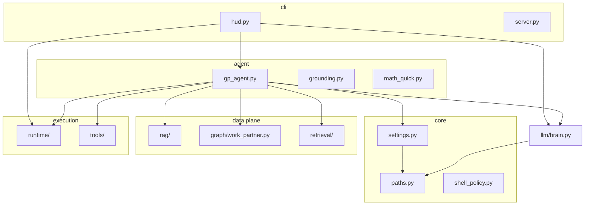

# 03 — Architecture

## Source layout (`src/jarvis`)

## Package responsibilities (inch by inch)

| Module | Responsibility |
|--------|------------------|
| **`jarvis/__init__.py`** | Calls `apply_runtime_settings()`; defines `__version__`. |
| **`jarvis/__main__.py`** | Delegates to `jarvis.cli.hud:main` (terminal HUD). |
| **`jarvis/core/paths.py`** | `JARVIS_HOME`, `knowledge_dir`, `config_dir`, paths to UI HTML, logs, automation/smarthome JSON. |
| **`jarvis/core/settings.py`** | Parse `config/jarvis.json`, populate `JarvisRuntimeSettings`, `setdefault` env keys. |
| **`jarvis/core/shell_policy.py`** | Regex-based detection of privileged/destructive shell strings; `REFUSAL_MESSAGE`. |
| **`jarvis/llm/brain.py`** | Ollama HTTP client, system context (macOS-heavy), history, `think` / `think_stream`, `detect_intent`. |
| **`jarvis/agent/gp_agent.py`** | `GeneralPurposeAgent`: routing, memory facts, tools, math, grounded pipeline. |
| **`jarvis/agent/grounding.py`** | Citation coverage check and retry prompt suffix. |
| **`jarvis/agent/math_quick.py`** | Safe AST arithmetic for natural language and calculator tool. |
| **`jarvis/runtime/orchestrator.py`** | `Orchestrator`: cwd-scoped shell, system stats helpers, `process_command` for simple CLI passthrough. |
| **`jarvis/runtime/skills.py`** | `SkillsManager`: built-in skills (`time`, `weather`, `system`, `knowledge`, …). |
| **`jarvis/rag/knowledge_base.py`** | File index JSON, chunking, optional `WorkPartner.index_document_from_text`, keyword fallback `query`. |
| **`jarvis/graph/work_partner.py`** | Neo4j driver, schema bootstrap, embeddings via Ollama, hybrid retrieve, grounded prompt builders, suggested actions. |
| **`jarvis/retrieval/expand.py`** | Stateless one-shot Ollama prompt to rewrite user query for search (optional). |
| **`jarvis/tools/registry.py`** | JSON `{"tool":…,"args":…}` dispatch: `now`, `calculator`, `list_tools`. |
| **`jarvis/cli/hud.py`** | Terminal UI, command dispatch, ingest, `ask`, shell confirmation UX. |
| **`jarvis/cli/server.py`** | HTTP server for web UI; serves `ui/index.html` via `html_index_path()`. |
| **`jarvis/voice/*`** | macOS-oriented capture/TTS helpers. |
| **`jarvis/integrations/*`** | `SmartHome`, `Automation` config-driven stubs. |
| **`jarvis/legacy/app_legacy.py`** | Older monolithic `JARVIS` class wiring agent + voice. |

## Typical HUD request path (simplified)

1. User types a line in `HUD.handle_command`.
2. Built-in commands (`help`, `ingest`, `shell`, …) handled first.
3. **Skills** matched by prefix (`SkillsManager.match_skill`).
4. **`JARVISBrain.detect_intent`** + **`Orchestrator.process_command`** for command-shaped input.
5. Else **`GeneralPurposeAgent.process_grounded`**: retrieval + LLM with citations, or fallbacks documented in [Agent](04-agent.md).

## UI shims (`ui/`)

`ui/hud.py` and `ui/server.py` re-export CLI mains for older paths; canonical entry is `jarvis.cli.*`.
